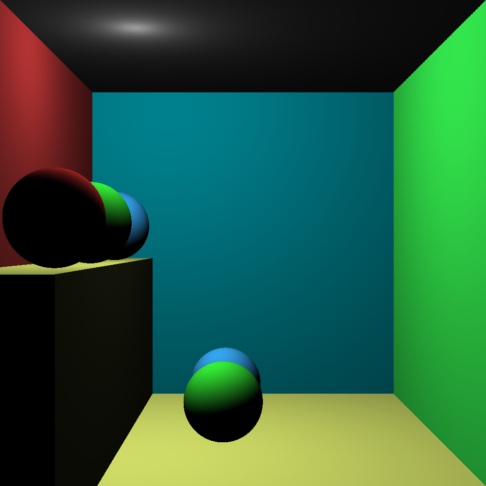

# RayTracing

A small OpenGL/GLUT-based ray tracing project written in C++. Displays a Cornell Box by default.

## Overview

This repository builds a simple ray tracer that reads a scene description from `scene.sdf`, renders the scene line-by-line, and displays the result in an OpenGL window.

## Features

- C++17 ray tracing implementation
- Uses OpenGL and GLUT/FreeGLUT for rendering
- Supports scene input from `scene.sdf`
- Writes pixel data output to `Resultat.ppm`

## Requirements

- CMake 3.14 or newer
- A C++17-compatible C++ compiler
- OpenGL development headers and libraries
- GLUT or FreeGLUT support
- On macOS, Xcode Command Line Tools

## Installation

### Linux

Install build tools, CMake, and OpenGL/FreeGLUT development packages.

Debian/Ubuntu:

```sh
sudo apt update
sudo apt install build-essential cmake libglu1-mesa-dev freeglut3-dev mesa-common-dev
```

Fedora/RHEL/CentOS:

```sh
sudo dnf install gcc-c++ cmake freeglut-devel mesa-libGL-devel mesa-libGLU-devel
```

Arch Linux:

```sh
sudo pacman -Syu base-devel cmake freeglut mesa
```

### macOS

Install Xcode Command Line Tools and CMake.

```sh
xcode-select --install
brew install cmake
```

Optionally install FreeGLUT for better compatibility:

```sh
brew install freeglut
```

On Apple platforms, CMake will use the system OpenGL/GLUT frameworks automatically.

### Windows

Install Visual Studio 2019 or 2022 with the "Desktop development with C++" workload, or another compatible MSVC toolchain.

Install CMake if needed:

```powershell
winget install --id Kitware.CMake
```

This project will use system GLUT if found. On Windows and non-Apple systems, CMake can fetch FreeGLUT automatically if GLUT is missing.

## Build

From the project root:

```sh
mkdir -p build
cd build
cmake -DCMAKE_BUILD_TYPE=Release ..
cmake --build . --config Release
```

To build a debug configuration:

```sh
cmake -DCMAKE_BUILD_TYPE=Debug ..
cmake --build . --config Debug
```

If you are using Visual Studio, open the generated solution in `build/` and build the `Raytracer` target.

## Run

From the `build` folder:

Linux/macOS:

```sh
./Raytracer
```

Windows:

```powershell
.
# or
.\Release\Raytracer.exe
```

The application expects `scene.sdf` in the current working directory. If the file is missing, it prints `No Scene Found`.

## Packaging and Shipping

- Do not commit `build/`, `Debug/`, `Release/`, or other generated build artifacts to GitHub.
- Do not include GLUT/FreeGLUT or graphics libraries as checked-in source files.
- If you want to distribute binaries, publish them as GitHub Release assets rather than storing build outputs in the repository.

## Notes

- CMake first tries to use system GLUT. If no system GLUT is available on Linux/Windows, it fetches FreeGLUT automatically.
- Rendered output files such as `Resultat.ppm` and `results/` are excluded by `.gitignore`.
- The renderer draws incrementally using `glutIdleFunc` while the ray tracer computes the image.

## Files

- `AppMain.cpp` - application entry point, GLUT callbacks, and main loop
- `Raytracer.cpp` / `Raytracer.h` - ray tracing core logic
- `Scene.cpp` / `Scene.h` - scene loading and object management
- `Reader.cpp` / `Reader.h` - scene file parsing
- `CMakeLists.txt` - project build configuration

## License

No license is defined in this repository. Add a license file if you want to share or reuse the code.
